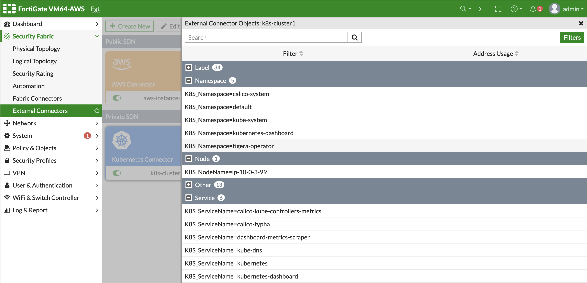
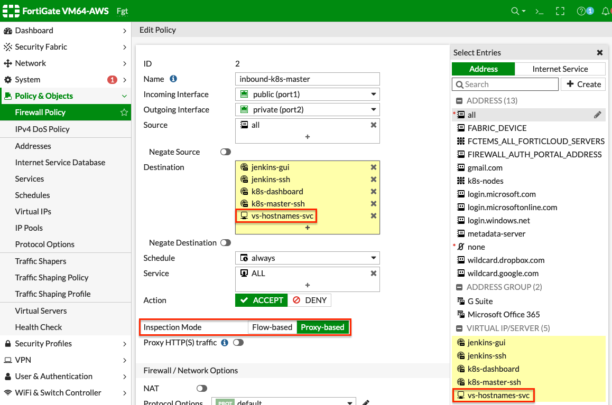
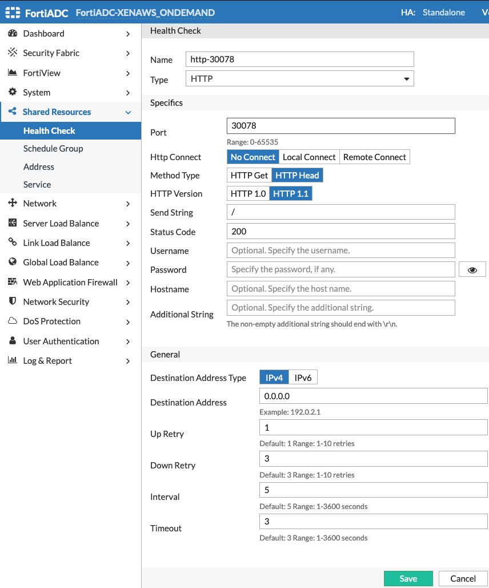
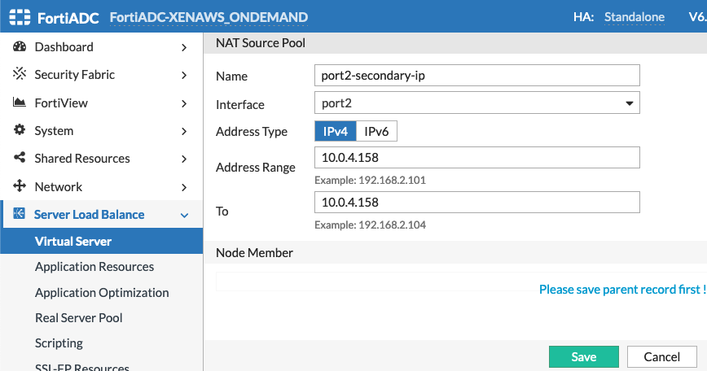
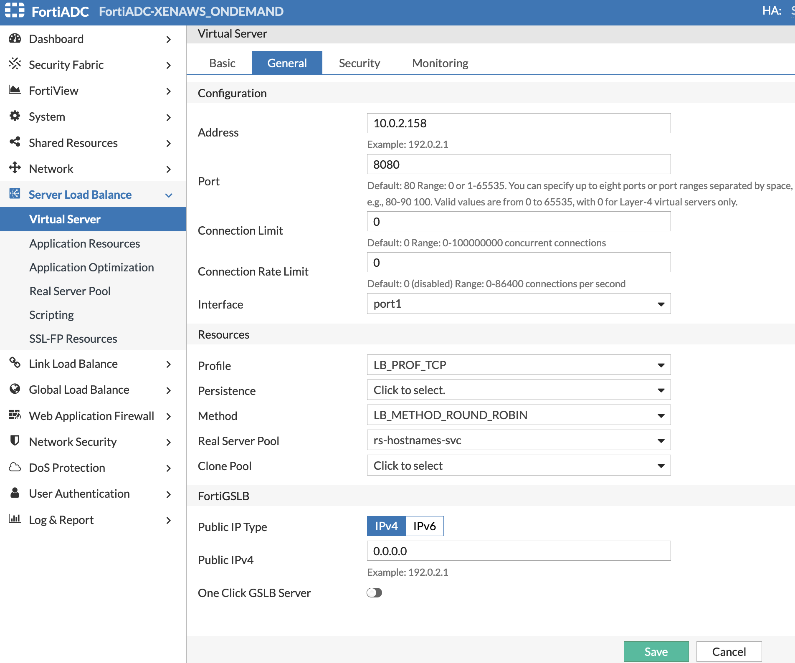
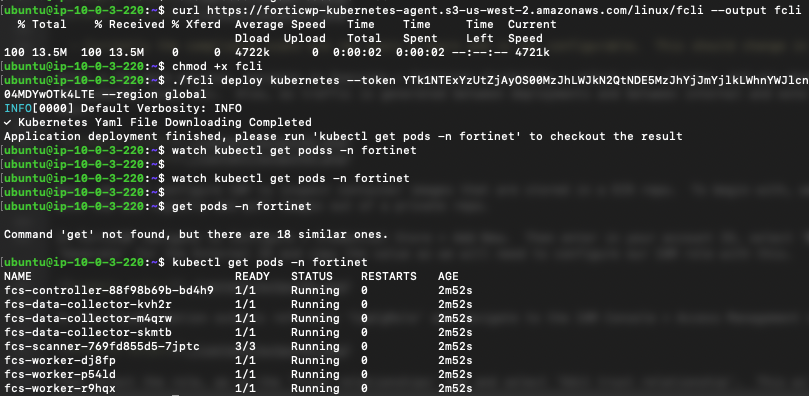
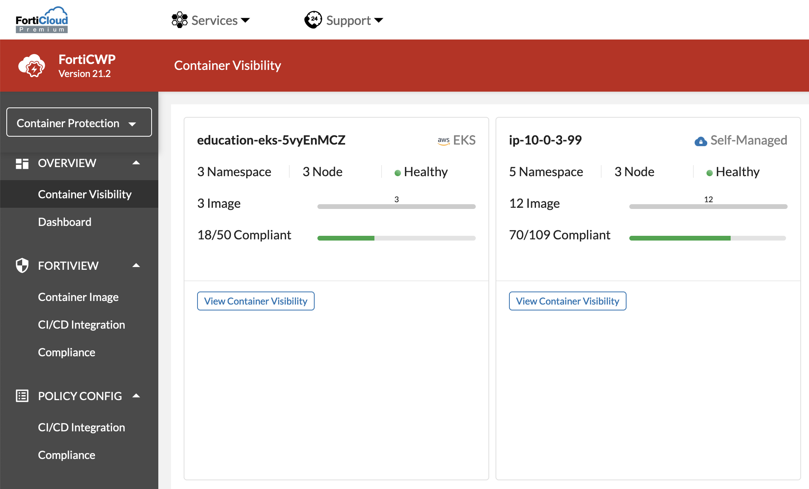

# Fortinet + Kubernetes Lab


## Table of Contents
  - [Overview](./README.md#overview)
  - [Solution Components](./README.md#solution-components)
  - [Template Deployment](./README.md#template-deployment)
  - [Getting Started](./README.md#getting-started)
  - [FortiGate](./README.md#FortiGate)
  - [FortiADC](./README.md#FortiADC)
  - [FortiCWP](./README.md#FortiCWP)

## Overview
Kubernetes is a very powerful platform for scaling containers in production to meet user demand.  However, K8s clusters are quite complex and the default configuration should be hardened to reduce the attack surface.  Here are some of the top security concerns about running K8s clusters in production:
  - Misconfigurations & Exposure
  - Failed Compliance Audits
  - Image Vulnerabilities
  - Runtime Threats

The purpose of this lab is for users to become more familiar with Kubernetes and how to integrate FortiGates, FortiADC, and FortiCWP with Kubernetes clusters to reduce the attack surface.

During this lab the SDN connector will be configured on both the FortiGate and FortiADC to provide information on pods and services to be able to protect inbound access to exposed applications.  FortiCWP Kubernetes agents will be deployed within the cluster to provide better visibility about the cluster configuration and to apply CIS benchmark reporting.

FortiGate Benefits:
  - NGFW security inspection including SSL MitM can be applied inline to protect containers from runtime threats
  - Ingress traffic can be easily be inspected when a K8s service is exposed as a nodePort type
  - Egress, and even East-West traffic between nodes can be inspected (granularity depends on the CNI plugin used and if pod IPs are routable outside the K8s cluster)

FortiADC Benefits:
  - Full WAF security inspection including SSL MitM can be applied inline to protect containers from runtime threats

FortiCWP Container Guardian Benefits:
  - CIS Benchmarks are ran to identify configuration that is not compliant with best practices which can expand the attack surface of a cluster
  - Container image scanning on build requests and regular registry scans identifies vulnerable images
  - CI\CD integration with Jenkins provides image scanning when images are created as part of a build request, these requests can be failed based on vulnerabilities found
  - Graphical visibility into K8s deployments and also traffic patterns within the cluster and even to internal\external resources outside the cluster

**Note:**  Please visit [www.fortinet.com](https://www.fortinet.com/) for further information.

## Solution Components
The lab environment will create a simple VPC with public and private subnets across two availability zones.  A FortiGate and FortiADC will be deployed in the public subnets while a single K8s master node will be created in a private subnet.  An autoscale group of worker nodes is provisioned and ready for nodes to be instantiated to join the cluster.

The K8s master is provisioned with Calico as the CNI plugin to manage IPAM for the pods as well as kube-proxy integration and network policy enforcement.  Currently Calico is configured with VXLAN Always which means that any internal communication between the cluster (ie pod to pod, pod to service, etc) will be either within a single node or between nodes over a VXLAN tunnel as the pod and service IPs are not routable in this lab.

The high-level building blocks for networking within Kubernetes are:
  - namespace:  This is a logical copy of the networking stack on a node with its own routes, interfaces, and other objects.
  - pod:  A group of one or more containers sharing the same resources (ie namespace, storage, cgroups, etc).  This is the smallest form of compute in Kubernetes.
  - daemon set: A set of pods that will be ran on every node within a cluster.  Typically, you will see this with CNI plugins and parts of the FortiCWP Kubernetes agent.
  - veth:  A virtual ethernet interface that can act as a tunnel between network namespaces.  This is commonly used to connect pod namespaces to the host namespace.
  - kube-proxy:  A network proxy (that uses host packet filtering, ie iptables, ebpf, etc) that runs on every node within the cluster.  This proxy implements services that allow pods to be easily accessible within or outside of the cluster.  Here are some common service types:
    * ClusterIP:  This is a service (think Virtual IP) that is only accessible within the cluster.  When traffic is received on the ClusterIP, kube-proxy will then DNAT the traffic to the backend endpoint such as a pod tied to the service.
    * NodeIp:  This is a service that is externally available on every node in the cluster on a dedicated node port, (ie tcp://nodeIp:nodePort).  Once traffic is received on the nodePort, kube-proxy will match the traffic to the internal clusterIP for the same service which ultimately delivers the traffic to the endpoints of the service.
    * LoadBalancer: This is a service that is externally available with public cloud load balancing services.  The load balancer will typically target a nodePort service for health checks and delivering traffic to the pods tied to the service.
  - Ingress-Controller:  When exposing HTTP(S) applications, you can use an ingress object which has a separate controller monitoring the cluster for these ingress objects.  The controller will then provision access through another solution (such as nginx, haproxy, etc) to expose the application and provide additional services such as security.
  - CNI:  A container network interface plugin that handles the IPAM and network setup of pods, services, etc and integrates with kube-proxy.  Additionally, the CNI plugin can provide other services such as Calico managing Kubernetes network policies as well to isolate namespaces from each other.

Here is a high-level diagram showing a 2 node cluster with the Calico CNI plugin.


Here is a similar diagram showing the same cluster but using the AWS VPC CNI plugin.  Notice how each pod now has a routable IP address.


Below are reference documentation and videos for a deeper dive on Kubernetes networking:
  - [K8s Networking on AWS](https://www.youtube.com/watch?v=7LRtytR6ZbA)
  - [K8s Services](https://www.youtube.com/watch?v=NFApeJRXos4)
  - [K8s Ingress Networking](https://www.youtube.com/watch?v=40VfZ_nIFWI)
  - [K8s Service Types](https://kubernetes.io/docs/concepts/services-networking/service/#publishing-services-service-types)
  - [K8s Ingress Networking](https://kubernetes.io/docs/concepts/services-networking/ingress/)
  - [K8s Ingress Controllers](https://kubernetes.io/docs/concepts/services-networking/ingress-controllers/)
  - [EKS Pod Networking](https://docs.aws.amazon.com/eks/latest/userguide/pod-networking.html )
  - [AWS VPC CNI](https://github.com/aws/amazon-vpc-cni-K8s)

The SDN connector accesses Kubernetes control plain which uses role-based access for authentication.  An RBAC Role or ClusterRole contains rules that represent a set of permissions on resources.  The main difference between the two roles is that Roles are bound to a namespace while ClusterRoles are not.  Generally, FortiXYZ products will use ClusterRoles to access deployments across multiple namespaces.

The rules in a Role\ClusterRole can provide access to API Groups and resources using logic such as API groups, resources, and verbs.
  - API Groups: (ie apiGroups: [""]) Generally, FortiXYZ will need access to the core API group 
  - Resources: (ie resources: ["pods", "services", "nodes", "namespaces", "deployments", "secrets", "configmaps"]) Inline devices such as FortiGate & FortiADC need access to pods, services, nodes, and namespaces.  FortiCWP will need access to more as local Kubernetes agents will be deployed within the cluster.
  - Verbs: (ie verbs: [ "get", "watch", "list", "create", "update", "patch", "delete"]) Inline devices such as FortiGate & FortiADC need verbs to get, watch, list for read only access.  FortiCWP will need access to more as local Kubernetes agents will be deployed within the cluster.

Kubernetes Roles\ClusterRoles are bound to a subject with RoleBindings\ClusterRoleBindings definition.  These subjects can be users, groups, or serviceAccounts.

Finally, tokens can be pulled from secrets tied to subjects to get credentials for an SDN connector to access the Kubernetes control plane.

When working with managed K8s clusters such as EKS, AKS, and GKE, config maps are typically used to map cloud provider IAM roles to K8s users\groups.  This will be used when integrating CWP with managed K8s clusters in EKS.

Below are reference documentation for a deeper dive on Kubernetes RBAC:
  - [K8s RBAC](https://Kubernetes.io/docs/reference/access-authn-authz/rbac/)
  - [K8s Authorization](https://Kubernetes.io/docs/reference/access-authn-authz/authorization/)
  - [EKS add user role](https://docs.aws.amazon.com/eks/latest/userguide/add-user-role.html)
  - [FortiCWP ConfigMap for EKS](https://docs.fortinet.com/document/forticwp/21.2.0/online-help/698697/add-iam-role-to-Kubernetes-configmap)

## Template Deployment
Before attempting to create a stack with the template, a few prerequisites should be checked to ensure a successful deployment:
1.	An AMI subscription must be active for the Ubuntu 18.0lts and for FortiGate + FortiADC license types being used in the template.
  * [Ubuntu 18.04lts Marketplace Listing](https://aws.amazon.com/marketplace/pp/prodview-pkjqrkcfgcaog)
  * [FortiGate BYOL Marketplace Listing](https://aws.amazon.com/marketplace/pp/prodview-lvfwuztjwe5b2)
  * [FortiGate PAYG Marketplace Listing](https://aws.amazon.com/marketplace/pp/prodview-wory773oau6wq)
  * [FortiADC BYOL Marketplace Listing](https://aws.amazon.com/marketplace/pp/prodview-dgvszo5n2fpn6)
  * [FortiADC 1Gbps PAYG Marketplace Listing](https://aws.amazon.com/marketplace/pp?sku=48mujlupx1q4elqee7q7k4c0j)
2.	The solution requires 2 EIPs to be created so ensure the AWS region being used has available capacity.  Reference [AWS Documentation](https://docs.aws.amazon.com/AWSEC2/latest/UserGuide/ec2-resource-limits.html) for more information on EC2 resource limits and how to request increases.
3.	If BYOL licensing is to be used, ensure these licenses have been registered on the support site.  Reference the VM license registration process PDF in this [KB Article](http://kb.fortinet.com/kb/microsites/search.do?cmd=displayKC&docType=kc&externalId=FD32312).
4.   **Create a new S3 bucket in the same region where the template will be deployed.  If the bucket is in a different region than the template deployment, bootstrapping will fail and the K8s master node will be inaccessible**.
5.  If BYOL licensing is to be used, upload these licenses to the root directory of the same S3 bucket from the step above.
6.  In order to use FortiCWP, you need to register FortiCWP Container Guardian licenses (sku: FC1-10-FCWPC-327-02-12) to your FortiCare account

Once the prerequisites have been satisfied, login to your account in the AWS console and proceed with the template deployment, reference the parameter descriptions to make appropriate selections.

## Getting Started

Using the CloudFormation outputs, use the 'K8sMasterSSH' info to ssh into the K8s master node with the 'K8sMasterSSH' output.  Once logged in, run the command below to watch the bootstrapping process of the host.  Once you see '-=-=-=-=-=- end of script -=-=-=-=-=-’ the K8s master node is ready, you can use ctrl-c to stop the tail.


    tail -f /var/log/cloud-init-output.log


To get familiar with the existing deployments, we will step through a few commands to gather more information.

For example, to get information such as the kubectl client version and Kubernetes version of the master, the control-plane location, and authentication context, we can use the commands below.

    kubectl version --short=true
    kubectl cluster-info
    kubectl config view


  - What is the IP and Port of the K8s control plane API that kubectl is connecting to?
  - What user\service account is kubectl using to authenticate with?

To get information about the cluster nodes, core & CNI plugin components, we can use the commands below.  

    kubectl get nodes
    kubectl get nodes -o wide
    kubectl get all -A
    kubectl get all -A -o wide
    kubectl get all -n calico-system	

  - What information do you get from get nodes or get all with the '-o wide' option that is interesting?
  - What types of resources do you see with the get all command (ie pods, services, daemon sets, replica sets)?
  - Why are resources from the calico-system namespace only shown in the last command?

Run the commands below to deploy the Kubernetes dashboard and dump admin and read-only serviceAccount tokens for authentication.

    dashboard status
    dashboard start
    kubectl get all -n kubernetes-dashboard -o wide

Using the CloudFormation outputs, login to both the FortiGate and K8s dashboard and use the tokens dumped from the previous commands to login.

  - From looking at the VIP object that was bootstrapped on the FGT, which and what type of K8s service is exposing the pod ‘pod/Kubernetes-dashboard’ to be accessible outside of the K8s cluster?

## FortiGate

In this section we will be configuring the SDN connector on the FortiGate to use dynamic address objects along with a virtual server to provide secured ingress access to an application on our K8s cluster.

On the K8s master, run the commands below to deploy the hostnames deployment which serves up the pod hostname over http.

    kubectl apply -f https://hacorp-base.s3.amazonaws.com/k8s-hostnames.yaml
    kubectl get all -n hostnames-ns -o wide
    kubectl describe node `hostname` | grep Taints

At this point you will notice the pod/hostnames is in pending status since by default pods are only scheduled to run on worker nodes.

  - Why is the pod in pending status?

In the EC2 console, navigate to Auto Scaling > Auto Scaling Groups and edit the existing worker asg details to have a min 1, desired 1, max 1.


On the K8s master, run the command below and wait until the worker node joins the cluster and is in ready state.

    watch kubectl get nodes -o wide

Stop the watch with ctrl-c and then run the command below to see the pod/hostnames running along with the other components of the namespace.

    kubectl get all -n hostnames-ns -o wide

  - What node is the pod/hostnames running on now?

When you successfully can access the service through the fgt, you will see the hostname of the running pod as a response.

To configure the FortiGate SDN Connector we will need to gather details from the K8s master first.  With the command below, we can get the IP address and port that the FortiGate needs to reach the Kubernetes control plane API for this cluster.

    kubectl cluster-info

Next, we will need to create a service Account, clusterRole, and clusterRoleBnding to provide read only access for the FortiGate to get information about pods, services, nodes, and namespaces.  Copy and paste the content below into a text file named 'fortinet-sdn-connector.yaml' on the K8s master.

```sh
---
apiVersion: v1
kind: ServiceAccount
metadata:
  name: fortinet-sdn-connector
  namespace: default
secrets:
- name: fortinet-sdn-connector-token

---
apiVersion: rbac.authorization.k8s.io/v1
kind: ClusterRole
metadata: 
  name: fortinet-sdn-connector
  namespace: default
rules: 
  - 
    apiGroups: 
      - ""
    resources: 
      - pods
      - namespaces
      - nodes
      - services
    verbs: 
      - get
      - watch
      - list

---
apiVersion: rbac.authorization.k8s.io/v1
kind: ClusterRoleBinding
metadata:
  name: fortinet-sdn-connector
  namespace: default
roleRef:
  apiGroup: rbac.authorization.k8s.io
  kind: ClusterRole
  name: fortinet-sdn-connector
subjects:
- kind: ServiceAccount
  name: fortinet-sdn-connector
  namespace: default
```

  - Notice the rules allowing read-only verbs on the resources of pod, service, node, namespace
  - What type of role and role binding are being used?

Then use kubectl to create the items in the file and finally gather the authentication token with the commands below.

    kubectl apply -f 'fortinet-sdn-connector.yaml'
    kubectl get secrets -o jsonpath="{.items[?(@.metadata.annotations['kubernetes\.io/service-account\.name']=='fortinet-sdn-connector')].data.token}"| base64 --decode


Login to the FortiGate and go to Security Fabric > External Connectors > Create New.  Then provide the ip + port of the Kubernetes control plane and the token you just gathered.


Once you have saved the configuration, you should see a green arrow pointing up on the K8s connector you created.  Right click on the connector and then select 'View Connector Objects' in the pop-up window to see metadata you can use.




To see what labels are applied to the nodes and pods, run the commands below.  The labels applied to the nodes can be used to get a list of node IPs.

    kubectl get nodes --show-labels
    kubectl get pods -n hostnames-ns --show-labels

Go to Policy & Objects > Addresses > Create New > Address.  Provide a name, set the type to dynamic, the sub type to your K8s sdn connector, then select K8s_Label.Kubernetes.io/os=linux as your filter.  After saving your address object wait for FortiOS to poll the K8s api and update the object (polls ever 60 seconds by default) and refresh the addresses page to see the resolved IP addresses for the object.


Then go to Policy & Objects > Health Check > Create New.  Provide a name, set the type to http, leave the URL as is, and set the nodePort value for the hostname-svc service as the port.  You can get the nodePort for the service from the output of either command below.


    kubectl get service -n hostnames-ns
    kubectl get all -n hostnames-ns


Then go to Policy & Objects > Virtual Server > Create New.  Select HTTP for the type, port1 for the interface, specify 0.0.0.0 for the virtual server ip, provide a unique virtual server port such as 8080, select your health check, and under real servers select new, dynamic, specify the correct port, and pick your dynamic address object from earlier.


Finally go to Policy & Objects > IPv4 Policy and edit the 'inbound-K8s-master' firewall policy.  Set the inspection mode to 'Proxy-based' and then add the virtual server to your destination objects.



To view the virtual server statistics, go to Dashboard and click the + sign on the navigation panel to add a monitor and add a Load Balancer Monitor.  You should see the status of your health checks against the dynamically discovered nodes on the correct nodePort for the hostnames-svc service.


As you generate traffic to the EIP of the FortiGate on your unique port you should see the pod respond with its hostname.


## FortiADC

In this section we will be configuring the SDN connector on the FortiADC to dynamically resolve endpoints registered to a K8s service along with a virtual server to provide secured ingress access to an application on our K8s cluster.

Login to the FortiADC using the CloudFormation outputs, cancel out of the 'System Getting Started Wizard', and go to Network > Interface.  Edit port2 and set the mode to DHCP and save the settings.  If you refresh the interfaces page you should see port2 pull an IP via DHCP.


Next navigate to Network > Routing and create a new static route.  With the default CIDRs in the CloudFormation Template the VPC CIDR is 10.0.0.0/16 and the port2 interface of FortiADC should be in the 10.0.4/24 subnet.  Create a route with the VPC CIDR as the destination and the next hop as 10.0.4.1 to hand off traffic to the AWS intrinsic router.


To configure the SDN connector navigate to Security Fabric > External Connectors > Create New.  Then provide the same IP address, port, and token information that was used for the FortiGate SDN Connector.  You can use the commands below.

    kubectl cluster-info
    kubectl get secrets -o jsonpath="{.items[?(@.metadata.annotations['kubernetes\.io/service-account\.name']=='fortinet-sdn-connector')].data.token}"| base64 --decode


Let's create a health check by navigating to Shared Resources > Health Check and create a new one.  For the port, provide the nodePort for the hostnames-svc service.  You can use the command below to get the relevant information about the hostnames-svc in the hostnames-ns namespace.

    kubectl get service -n hostnames-ns




Next, create a NAT source pool by going to Server Load Balance > Virtual Server > NAT Source Pool > Create New.  Specify port2 as the interface and in the EC2 console, grab the secondary IP assigned to ENI1 of FortiADC.

  - FortiADC does not allow using the primary IPs of interfaces in NAT Source Pools configuration, so we assigned secondary IPs to the EC2 Instance.




Next, create the real server pool by navigating to Server Load Balance > Real Server Pool > Create New.  For the type select dynamic, select your SDN Connector, select the hostnames-svc service and select your health check.  Save the virtual server and edit it again and FortiADC should retrieve the nodes supporting the currently deployed service.

  - Notice how FortiADC dynamically resolve the nodes and nodePort to use for this service.


Finally go to Server Load Balance > Virtual Server > Create New > Advanced.  On the 'Basic' tab, name the virtual server and set the 'Packet Forwarding Method' to 'Full NAT' and select the NAT source pool you previously created.  On the 'General' tab specify the secondary IP of ENI0 as the address for the virtual server and set a unique port.  Then on the 'Monitoring' tab enable both 'Traffic Log' and 'Fortiview' and save the virtual server config.





Now you can see a live view of the real server pool by going to FortiView > Logical Topology.  


Using the CloudFormation Template outputs, access your FortiADC virtual server using the EIP dedicated for virtual servers should return the hostname of your single hostnames pod.

  - Notice that if you look at the output of 'kubectl get pods -n hostnames-ns -o wide' the single pod is only running on one worker node, however other nodes will listen on the nodePort and redirect traffic via kube-proxy to a node with the pod running locally.

Let's scale the number of pods running to see the effect on the nodePort service with the commands below.

    kubectl scale deployment hostnames-dp --replicas=2 -n hostnames-ns
    kubectl get pods -n hostnames-ns -o wide


 - The number of pods does not change the number of nodes in the cluster so there is no change from the FortiGate or FortiADC perspective.  However, accessing the virtual server will show more pod hostnames on the backend.

To scale the number of worker nodes go to the EC2 console, navigate to Auto Scaling > Auto Scaling Groups and edit the existing worker asg details to have a min 2, desired 2, max 2.  On the K8s master, run the command below and wait until the worker node joins the cluster and is in ready state.


    watch kubectl get nodes -o wide

Once the new worker joins the cluster in ready state, check the Logical Topology to see that the additional node tied to the hostname-svc is showing up and eventually healthy.


## FortiCWP

Log into your FortiCWP account, select 'Container Protection' in the upper left-hand corner.  Then click on 'Company' in the upper righ- hand corner to see your current licensing.  If you do not have any Container Guardian licensing, you will need to order the SKU 'FC1-10-FCWPC-327-02-12'.  A qty of one for this SKU will license you for 4 nodes, so please request the appropriate amount for your environment.


Next, navigate to Configure > Kubernetes Cluster > Add New.  The easiest and fastest way to get a cluster added is to specify 'Private Cloud' for the Kubernetes Platform and 'Self-Managed' for the Kubernetes Type.  Then you will be directed to download the fcli tool to then register your Kubernetes cluster with a unique token to your FortiCWP portal.


You can run the commands below with your unique token to deploy the FortiCWP Kubernetes Agents and watch the pods eventually go into running status.

    curl https://forticwp-kubernetes-agent.s3.amazonaws.com/linux/fcli --output fcli
    chmod +x fcli
    ./fcli deploy kubernetes --token <-your-cwp-token-> --region global
    watch kubectl get pods -n fortinet



Within a few minutes if you refresh the Configure > Kubernetes Cluster page, you should see your cluster in healthy status.


Within a few more minutes you should see the results of a compliance check against your cluster's current configuration under FortiView > Compliance > and click on the blue report icon on the right.


  - Currently the compliance scans are ran every 6 hours and is not configurable.  This should change in future versions.

After a few more minutes, navigate to Overview > Container Visibility > select your cluster, and you should see a visual representation of your namespaces, deployments, pods, etc.  Also, as traffic is generated between deployments and between internal and external resources you will see greater detail on the connections seen.




Next, we will configure CWP to inspect container images that are stored in a ECR repo.  To begin with, we need to configure CWP with the credentials to authenticate with the ECR registry and pull images out of a private repo.

In FortiCWP navigate to Configure > Credential Store > Add New.  Then enter in your account ID, select 'Manually by myself' for IAM Role Creation Method, and select 'Generate' for the External ID and copy the value as we will need to configure our IAM role with this.


In the CloudFormation outputs reference 'CwpCgRole' and navigate to the IAM Console > Access Management > Roles and search for the same role.


Then select the role, go to the 'Trust relationships' tab and select 'Edit trust relationship'.  This will open the JSON formatted policy document in a text editor.  Update the value for 'sts:ExternalId' to the External ID value from the FortiCWP console and save your changes.


Back in the FortiCWP console, select next step and provide the IAM Role ARN which can be gathered from the IAM console or the CloudFormation outputs and select add IAM role.


Next select add registry and use the CloudFormation outputs to get the ECR Registry URL and Repo name.  Then select your IAM Role you just added and also your K8s cluster where the images will be scanned.


After some time, you will see a few example images that have been uploaded to the repo with their risk score and detailed vulnerability report.


Using the CloudFormation outputs, login to the Jenkins host via the gui and also ssh.  Then run the command below to get the initial admin password.

	sudo cat /var/lib/jenkins/secrets/initialAdminPassword

Next you will be prompted to install plugins so select 'Install suggested plugins' and wait for all recommended plugins to install successfully.


Then you will be prompted to create the first admin user and then to set the access URL which the default selection should be accepted (ie http://fgt-eip:port8080).


Now on the Jenkins dashboard, go to Manage Jenkins > Manage Plugins > Available and search for 'forticwp' and install the plugin without restart.


In the FortiCWP console go to Configure > Kubernetes Cluster > Actions > View CI\CD Integration Configurations.  We will use this value in configuring the FortiCWP plugin in Jenkins. 


In the Jenkins console go to Manage Jenkins > Configure System and find the FortiCWP CICI Integration Configuration section.  Then copy and paste the access token and make sure your region matches what is shown in FortiCWP and select 'Verify Settings' to process the configuration.  Then select save at the bottom of the screen to apply the settings.


In the FortiCWP console go to Policy Config > CI/CD Integration.  For your Jenkins Url, use the FortiGate EIP and port 8080, then give your project a name. Finally check the box on critical vulnerabilities and leave the value at 1. 

 - *** Note *** that your Jenkins Project name should match what is used in Jenkins in the next step.


Go back to the Jenkinis dashboard and select 'New Item' on the left navigation panel, then give your project the same name as you did in the FortiCWP console, select 'Freestyle project' then ok.


On the next page scroll down to the build section and click add build step then execute shell.  Then you can copy and paste the code snippet below into the text box.  Finally add another build setup with 'Scan container images', enter 'demo_build:latest' as the value and check the box for 'Fail the build if result is not compliant'.

	echo '=---> some context <---='
	whoami
	pwd
	ls -lA
	echo $WORKSPACE
	docker image ls
	echo '=---> create docker file <---='
	rm -rf $WORKSPACE/
	mkdir -p $WORKSPACE/
	cd $WORKSPACE/
	ls -lA
	touch DockerFile
	echo 'FROM ubuntu:18.04' >> DockerFile
	echo 'RUN apt-get update && apt-get install -y redis-server && apt-get clean' >> DockerFile
	echo 'EXPOSE 6379' >> DockerFile
	echo 'CMD ["redis-server", "--protected-mode no"]' >> DockerFile
	echo '=---> create docker container with base image and layers <---='
	ls -lA
	cat DockerFile
	docker build -f DockerFile -t demo_build:latest .


On the project page select Build Now and in a few seconds, you should see the an entry in your build history.  Click on that and select console output on the next page to watch the build process including the FortiCWP plugin running the image scan and failing the build.


In the FortiCWP console go to FortiView > CI/CD Integration > select the build under your project 'demo_project' and you can see that FortiCWP block this build from passing due to vulnerabilities.  You can click on the detailed report on the right to see more information for that image scan.


----

